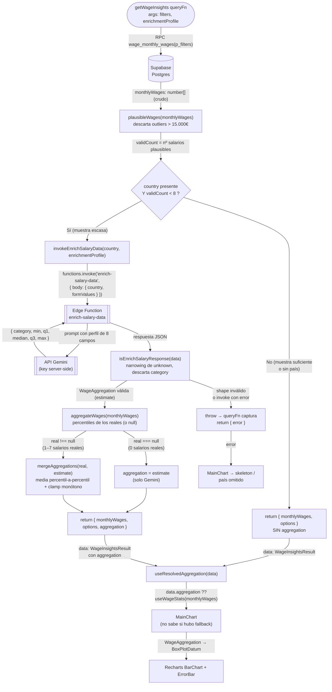

# Flujo de enriquecimiento con Gemini (muestras escasas)

Cuando la RPC de Supabase devuelve una muestra de salarios demasiado pequeña
para ser estadísticamente significativa (menos de `MIN_SAMPLE_SIZE = 8`
salarios plausibles, tras descartar outliers), el `queryFn` de
`getWageInsights` invoca la Edge Function `enrich-salary-data` (que llama a
Gemini server-side) y fusiona su estimación con los pocos datos reales. Todo
esto es invisible aguas abajo: `MainChart` pinta el box-plot sin saber si hubo
fallback.

Archivos clave:

- `src/features/salary-comparator/api/wageApi.ts` — `queryFn` de `getWageInsights` (orquesta el flujo).
- `src/features/salary-comparator/hooks/aggregateWages.ts` — `plausibleWages` (filtro de outliers + conteo) y `aggregateWages` (percentiles).
- `src/features/salary-comparator/api/enrichSalaryData.ts` — `invokeEnrichSalaryData` (wrapper tipado sobre la Edge Function).
- `src/features/salary-comparator/hooks/mergeAggregations.ts` — `mergeAggregations` (media percentil-a-percentil + clamp de monotonía).
- `src/features/salary-comparator/hooks/useResolvedAggregation.ts` — prefiere `data.aggregation` sobre recalcular.

## Notas sobre el flujo

- **El umbral se mide tras truncar** (`validCount`, no `monthlyWages.length`):
  los outliers de TABLE_0 no deben rellenar la muestra ni ocultar que hay pocos
  datos reales.
- **La API key de Gemini nunca llega al cliente**: el navegador solo invoca la
  Edge Function; la key vive como secret del proyecto Supabase.
- **`category` se descarta**: la Edge Function devuelve el nombre del país en
  `category`, pero los consumidores esperan un `WageAggregation` limpio
  (`{ min, q1, median, q3, max }`).
- **Fusión, no reemplazo** (salvo con 0 reales): con 1–7 salarios reales, la
  estimación de Gemini se promedia percentil-a-percentil con la agregación de
  los reales — no se sintetiza ningún array intermedio.
- **Los errores se propagan** (no se degrada en silencio): un fallo de la Edge
  Function o un país fuera de los 11 válidos devuelve `{ error }`, y `MainChart`
  muestra su estado de skeleton/error.
- **Transparencia aguas abajo**: `useResolvedAggregation` decide entre usar el
  `aggregation` ya resuelto (fallback) o derivar de `monthlyWages`; `MainChart`
  recibe siempre un `WageAggregation` y no distingue el origen.
- **Caché**: `getWageInsights` cachea por args (`keepUnusedDataFor: 300` s), así
  que revisitar la misma combinación de filtros dentro de 5 min no re-invoca a
  Gemini.
