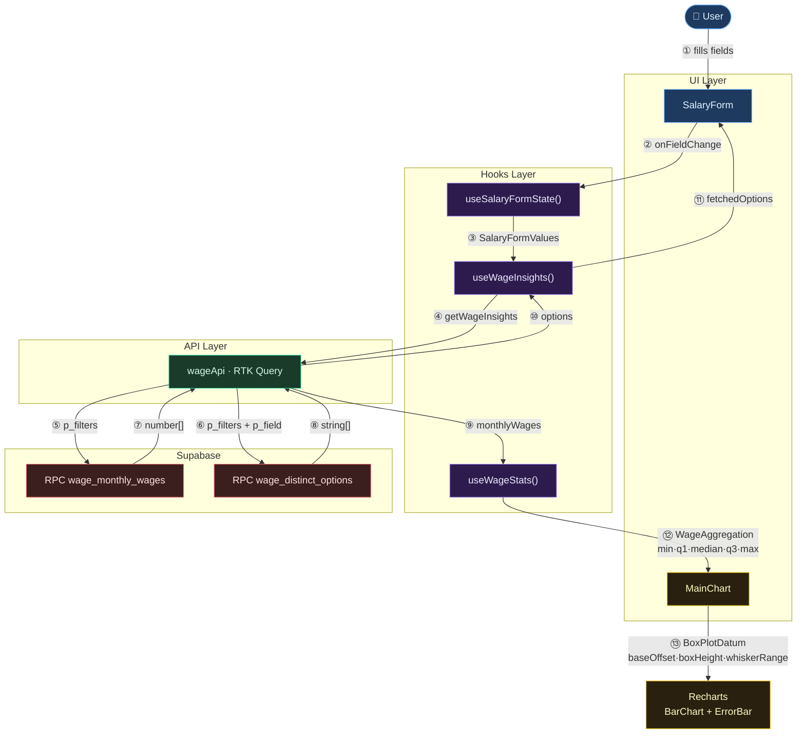

```mermaid
flowchart TD
    classDef ui        fill:#1e3a5f,stroke:#60a5fa,color:#e0f0ff
    classDef hook      fill:#2d1b4e,stroke:#a78bfa,color:#ede9fe
    classDef api       fill:#1a3a2a,stroke:#34d399,color:#d1fae5
    classDef db        fill:#3b1f1f,stroke:#f87171,color:#fee2e2
    classDef chart     fill:#2a2010,stroke:#facc15,color:#fef9c3

    User(["👤 User"]):::ui

    subgraph UI ["  UI Layer  "]
        SalaryForm["SalaryForm"]:::ui
        MainChart["MainChart"]:::chart
    end

    subgraph Hooks ["  Hooks Layer  "]
        State["useSalaryFormState()"]:::hook
        Insights["useWageInsights()"]:::hook
        Stats["useWageStats()"]:::hook
    end

    subgraph API ["  API Layer  "]
        WageApi["wageApi · RTK Query"]:::api
    end

    subgraph DB ["  Supabase  "]
        RPC1["RPC wage_monthly_wages"]:::db
        RPC2["RPC wage_distinct_options"]:::db
    end

    User -->|"① fills fields"| SalaryForm
    SalaryForm -->|"② onFieldChange"| State
    State -->|"③ SalaryFormValues"| Insights
    Insights -->|"④ getWageInsights"| WageApi
    WageApi -->|"⑤ p_filters"| RPC1
    WageApi -->|"⑥ p_filters + p_field"| RPC2
    RPC1 -->|"⑦ number[]"| WageApi
    RPC2 -->|"⑧ string[]"| WageApi
    WageApi -->|"⑨ monthlyWages"| Stats
    WageApi -->|"⑩ options"| Insights
    Insights -->|"⑪ fetchedOptions"| SalaryForm
    Stats -->|"⑫ WageAggregation\nmin·q1·median·q3·max"| MainChart
    MainChart -->|"⑬ BoxPlotDatum\nbaseOffset·boxHeight·whiskerRange"| Recharts["Recharts\nBarChart + ErrorBar"]:::chart
```
