# Flujo completo: del click en un Combobox al repintado de MainChart

Recorrido en tiempo de ejecución de **un solo cambio de campo** en el
formulario: desde que el usuario toca una `<li role="option">` dentro de
`Combobox` hasta que `MainChart` recibe las agregaciones y el siguiente
combobox de la cascada recibe sus opciones.

Los dos efectos del click viajan por **la misma** respuesta de
`getWageInsights` pero se reparten en ramas distintas: `options` vuelve al
formulario (alimenta el siguiente combobox) y `monthlyWages` / `aggregation`
bajan a la chart.

Archivos clave, en orden de aparición:

- `src/shared/components/ui/Combobox.tsx` — selección y cierre de la lista.
- `src/features/salary-comparator/components/SalaryFormField.tsx` — decide qué control renderiza cada `kind` y quién es el destinatario vivo de las opciones.
- `src/features/salary-comparator/components/CountryAwareCombobox.tsx` — endpoint propio para País, resto de campos desde la cascada.
- `src/features/salary-comparator/components/SalaryCalculator.tsx` — contenedor que cablea los hooks y reparte sus salidas.
- `src/features/salary-comparator/hooks/useSalaryFormState.ts` — dueño de `step` y de los 9 valores.
- `src/features/salary-comparator/hooks/useWageInsights.ts` — arma la query de la cascada y decide el `nextOptionsField`.
- `src/features/salary-comparator/api/wageApi.ts` — `queryFn` de `getWageInsights` (RPCs + fallback de Gemini).
- `src/features/salary-comparator/hooks/useResolvedAggregation.ts` — elige entre la agregación ya resuelta y la derivada.
- `src/features/salary-comparator/components/MainChart.tsx` — box-plot final.

```mermaid
%%{init: {"theme":"base","themeVariables":{"background":"#0b1220","fontFamily":"Poppins, Segoe UI, sans-serif","fontSize":"14px","textColor":"#e2e8f0","lineColor":"#94a3b8","edgeLabelBackground":"#0b1220","clusterBkg":"#0f172a","clusterBorder":"#334155","titleColor":"#f8fafc"}}}%%
flowchart TD
    classDef actor    fill:#1c2434,stroke:#cbd5e1,color:#f8fafc,stroke-width:2px
    classDef sharedui fill:#0e3a45,stroke:#22d3ee,color:#cffafe,stroke-width:2px
    classDef feature  fill:#1e3a5f,stroke:#60a5fa,color:#e0f0ff,stroke-width:2px
    classDef hook     fill:#2d1b4e,stroke:#a78bfa,color:#ede9fe,stroke-width:2px
    classDef pure     fill:#3a2410,stroke:#fb923c,color:#ffedd5,stroke-width:2px
    classDef api      fill:#12352a,stroke:#34d399,color:#d1fae5,stroke-width:2px
    classDef db       fill:#3b1f1f,stroke:#f87171,color:#fee2e2,stroke-width:2px
    classDef ai       fill:#3b1030,stroke:#f472b6,color:#fce7f3,stroke-width:2px
    classDef chart    fill:#2a2010,stroke:#facc15,color:#fef9c3,stroke-width:2px

    User(["👤 Usuario · tap o click en una opción"]):::actor

    subgraph S1 ["1 · Selección — shared/components/ui"]
        Li["Combobox.tsx · li role=option<br/>onPointerDown + preventDefault<br/>se adelanta al blur del input"]:::sharedui
        Sel["selectOption(option, keepFocus)<br/>keepFocus=false solo en tap táctil<br/>cierra el teclado en Android"]:::sharedui
        Close["closeList()<br/>isOpen=false · query vacía · activeIndex=-1"]:::sharedui
    end

    subgraph S2 ["2 · Elevación del cambio — features/salary-comparator/components"]
        FieldCB["CountryAwareCombobox.tsx<br/>solo kind combobox-fetched-options"]:::feature
        Field["SalaryFormField.tsx<br/>onChange(field.id, selected)"]:::feature
        Step["SalaryFormStep.tsx<br/>prop onChange"]:::feature
        Form["SalaryForm.tsx<br/>prop onFieldChange"]:::feature
        Calc["SalaryCalculator.tsx<br/>handleFieldChange(id, value)"]:::feature
    end

    subgraph S3 ["3 · Estado y derivación de la query — hooks"]
        FormState["useSalaryFormState.ts<br/>setFieldValue → setValues<br/>canAdvance = isStepComplete"]:::hook
        Scroll["useScrollToTop.ts<br/>solo si el campo dispara fetch"]:::hook
        Insights["useWageInsights.ts<br/>buildCascadeQuery(values)"]:::hook
        Filters["buildWageFilters.ts<br/>values → WageFilterParams"]:::pure
        NextField["findNextOptionsField(values)<br/>último campo relleno → siguiente fetched"]:::pure
        Profile["buildEnrichmentProfile.ts<br/>perfil de 7 claves para Gemini"]:::pure
    end

    Skip{"Filtros vacíos?<br/>aún sin país"}:::hook
    NoFetch["Query en skip · no se pide nada<br/>MainChart muestra el logo y el texto guía"]:::chart

    subgraph S4 ["4 · Datos — api/ y backend"]
        Api["wageApi.ts · getWageInsights<br/>fakeBaseQuery + queryFn<br/>caché por args · keepUnusedDataFor 300 s"]:::api
        RPC1[("RPC wage_monthly_wages<br/>p_filters")]:::db
        RPC2[("RPC wage_distinct_options<br/>p_filters + p_field")]:::db
        Plaus["plausibleWages()<br/>descarta salarios sobre 15.000 €"]:::pure
        Small{"country presente<br/>y validCount menor que 8?"}:::api
        Enrich["enrichSalaryData.ts<br/>invokeEnrichSalaryData + type guard"]:::api
        Edge[["Edge Function enrich-salary-data<br/>fuera del repo"]]:::ai
        Gemini[["API Gemini · key server-side"]]:::ai
        Agg["aggregateWages()<br/>percentiles de los salarios reales"]:::pure
        Merge["mergeAggregations()<br/>media percentil a percentil + clamp"]:::pure
    end

    Result["WageInsightsResult<br/>monthlyWages · options? · aggregation?"]:::api
    Comp["ComparisonCountryQuery.tsx<br/>una query paralela por país extra<br/>eleva su resultado con onResult"]:::feature

    subgraph S5 ["5 · Reparto de la respuesta"]
        Live["SalaryFormField.tsx · isLiveTarget<br/>field.filterColumn === nextOptionsField"]:::feature
        Country["CountryAwareCombobox.tsx<br/>añade el valor propio · disabled mientras carga"]:::feature
        ToOpts["toComboboxOptions.ts<br/>string[] → value/label"]:::pure
        NextCB["Combobox.tsx<br/>nueva lista de opciones lista para el usuario"]:::sharedui
        Resolve["useResolvedAggregation.ts<br/>data.aggregation ?? derivada"]:::hook
        Stats["useWageStats.ts<br/>useMemo sobre aggregateWages"]:::hook
        Series["SalaryCalculator.tsx · series[]<br/>país base primero, extras después"]:::feature
    end

    subgraph S6 ["6 · Pintado — MainChart"]
        Main["MainChart.tsx<br/>hasStarted · isLoading · series · userWage"]:::chart
        Loader["GeminiEnrichmentLoader.tsx<br/>frases rotativas con motion"]:::chart
        Datum["toBoxPlotDatum.ts<br/>baseOffset · boxHeight · whiskerRange"]:::pure
        Recharts["Recharts · BarChart apilado<br/>ErrorBar + shape BoxWithMedian + ReferenceLine"]:::chart
    end

    User -->|"①"| Li
    Li -->|"②"| Sel
    Sel -->|"③ onChange(option.value)"| Close
    Close -->|"④a kind fetched-options"| FieldCB
    Close -->|"④b kind static"| Field
    FieldCB -->|"⑤ prop onChange"| Field
    Field -->|"⑥ onChange(field.id, selected)"| Step
    Step -->|"⑦"| Form
    Form -->|"⑧ onFieldChange"| Calc
    Calc -->|"⑨ setFieldValue"| FormState
    Calc -->|"⑩ scrollToChart"| Scroll
    FormState -->|"⑪ nuevo SalaryFormValues · re-render"| Insights
    Insights -->|"⑫"| Filters
    Insights -->|"⑬"| NextField
    Insights -->|"⑭"| Profile
    Filters --> Skip
    Skip -->|"sí"| NoFetch
    Skip -->|"no · hay al menos País"| Api
    NextField -->|"nextOptionsField"| Api
    Profile -->|"enrichmentProfile"| Api
    Api -->|"⑮ supabase.rpc"| RPC1
    Api -->|"⑯ supabase.rpc si hay nextOptionsField"| RPC2
    RPC1 -->|"⑰ number[] crudo"| Plaus
    RPC2 -->|"⑱ string[] deduplicado en SQL"| Result
    Plaus -->|"validCount"| Small
    Small -->|"no · muestra suficiente"| Result
    Small -->|"sí · muestra escasa"| Enrich
    Enrich -->|"⑲ functions.invoke"| Edge
    Edge -->|"⑳ prompt con país y perfil"| Gemini
    Gemini -->|"㉑ min q1 median q3 max"| Agg
    Agg -->|"㉒a real null · se usa la estimación"| Result
    Agg -->|"㉒b hay 1-7 reales"| Merge
    Merge -->|"aggregation fusionada"| Result
    Comp -->|"mismos filtros con Country sobrescrito"| Api
    Comp -->|"Map país → agregación"| Series
    Result -->|"㉓ options"| Live
    Result -->|"㉔ data"| Resolve
    Stats -.->|"deriva de monthlyWages<br/>se llama siempre, sin condicional"| Resolve
    Resolve -->|"㉕ WageAggregation"| Series
    Live -->|"solo el campo destinatario"| Country
    Country --> ToOpts
    ToOpts -->|"㉖ opciones del siguiente combobox"| NextCB
    Series -->|"㉗ ComparisonSeries[]"| Main
    Main -->|"isFetching o falta la base"| Loader
    Main -->|"㉘ chartData"| Datum
    Datum -->|"㉙ BoxPlotDatum[]"| Recharts

    subgraph LEG ["Leyenda por tipo de archivo"]
        direction LR
        LG1["shared/components/ui"]:::sharedui
        LG2["componente de feature"]:::feature
        LG3["hook"]:::hook
        LG4["función pura"]:::pure
        LG5["api / RTK Query"]:::api
        LG6["Supabase RPC"]:::db
        LG7["IA server-side"]:::ai
        LG8["chart"]:::chart
    end
```

## Notas sobre el flujo

- **`onPointerDown`, no `onClick`**: el `click` llegaría después del `blur` del
  input, y `closeList()` ya habría desmontado la `<li>`. El `preventDefault`
  evita que el input pierda el foco antes de tiempo.
- **Un solo fetch para toda la cascada**: todos los campos
  `combobox-fetched-options` del paso comparten la misma `data.options`. El
  filtro `isLiveTarget` de `SalaryFormField` decide cuál de ellos puede
  renderizarlas como suyas; a los demás se les pasa `undefined`.
- **País es la excepción**: no tiene filtros acumulados todavía, así que sus
  opciones vienen de `getCountryOptions` (`keepUnusedDataFor: Infinity`), no de
  la cascada. Por eso vive en su propio componente: el hook de esa query no
  puede llamarse condicionalmente dentro de `SalaryFormField`.
- **Ni `SalaryForm` ni `MainChart` tocan datos**: el único que habla con hooks y
  RTK Query es `SalaryCalculator`. La chart es puramente presentacional.
- **`options` y `aggregation` van en la misma respuesta**: una sola llamada a
  `getWageInsights` alimenta a la vez el siguiente combobox y el box-plot.
- **Skip antes del primer país**: sin filtros no hay query; `MainChart` se queda
  en su estado inicial (`hasStarted === false`).
- **Detalle del fallback de Gemini**: ver `docs/diagrams/gemini-enrichment-flow.md`.
