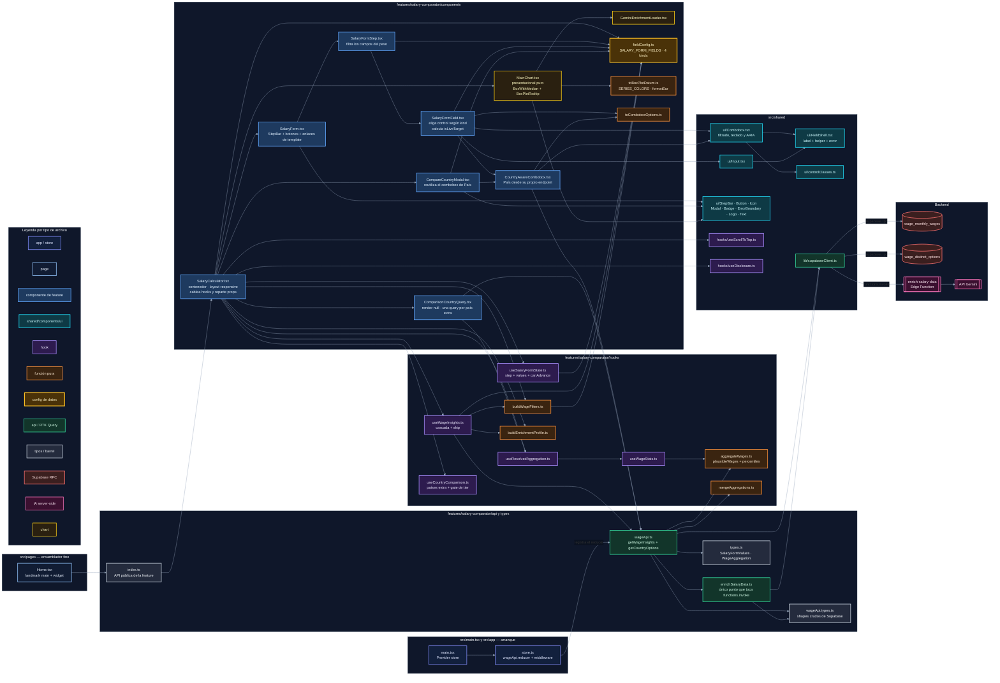

# Mapa de archivos de la feature salary-comparator

Vista estructural (quién importa a quién, no el orden temporal): los 27
archivos que participan en el calculador, agrupados por capa y coloreados por
tipo. Complementa a `docs/diagrams/salary-cascade-flow.md`, que recorre el mismo
sistema en el eje del tiempo.

Dos reglas de arquitectura se leen directamente en el dibujo:

1. **`fieldConfig.ts` es la fuente única de verdad del formulario.** Los 9
   campos son datos, no JSX, y lo leen cinco módulos distintos: los dos
   componentes que renderizan pasos, los dos que derivan filtros y el propio
   contenedor (para saber qué campos disparan scroll).
2. **Solo `SalaryCalculator` habla con la capa de datos.** `SalaryForm` y
   `MainChart` reciben todo por props; ninguno importa `wageApi` ni Supabase.

## Lecturas del mapa

- **`fieldConfig.ts` (amarillo, borde grueso) tiene cinco entradas**: añadir,
  reordenar o reagrupar un campo se hace ahí y nada más — ni los componentes de
  paso ni los constructores de filtros necesitan tocarse (OCP).
- **`supabaseClient.ts` es el único cuello de botella hacia el backend**, y solo
  lo importan `wageApi.ts` y `enrichSalaryData.ts`. Ningún componente conoce
  Supabase (SoC).
- **`aggregateWages.ts` es función pura, no hook**, precisamente porque la
  necesitan dos consumidores incompatibles: `useWageStats` (en render) y el
  `queryFn` de `wageApi` (fuera de React, donde no se puede llamar a un hook).
- **`ComparisonCountryQuery` renderiza `null`**: existe solo para poder llamar
  al hook de RTK Query un número variable de veces sin romper las reglas de
  hooks; un bucle de hooks sería ilegal.
- **`CountryAwareCombobox` tiene dos consumidores** (`SalaryFormField` y
  `CompareCountryModal`), y por eso acepta `excludeOptions`: el modal excluye el
  país base y los ya añadidos.
