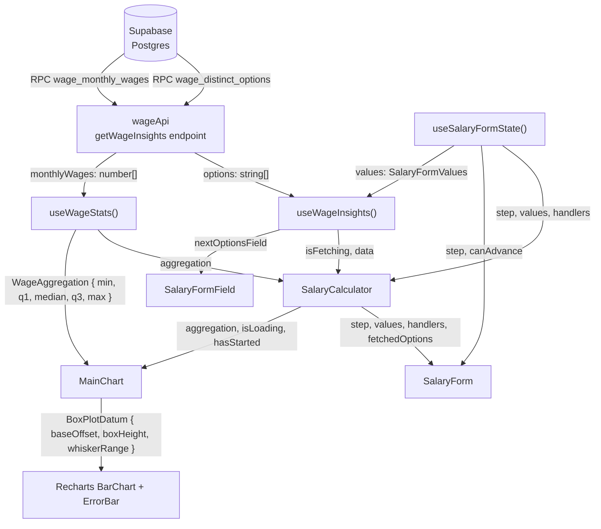

```mermaid
flowchart TD
    A[("Supabase\nPostgres")] -->|"RPC wage_monthly_wages"| B["wageApi\ngetWageInsights endpoint"]
    A -->|"RPC wage_distinct_options"| B
    B -->|"monthlyWages: number[]"| C["useWageStats()"]
    B -->|"options: string[]"| D["useWageInsights()"]
    D -->|"nextOptionsField"| E["SalaryFormField"]
    C -->|"WageAggregation { min, q1, median, q3, max }"| F["MainChart"]
    G["useSalaryFormState()"] -->|"values: SalaryFormValues"| D
    G -->|"step, canAdvance"| H["SalaryForm"]
    D -->|"isFetching, data"| I["SalaryCalculator"]
    C -->|"aggregation"| I
    G -->|"step, values, handlers"| I
    I -->|"aggregation, isLoading, hasStarted"| F
    I -->|"step, values, handlers, fetchedOptions"| H
    F -->|"BoxPlotDatum { baseOffset, boxHeight, whiskerRange }"| J["Recharts BarChart + ErrorBar"]
```
